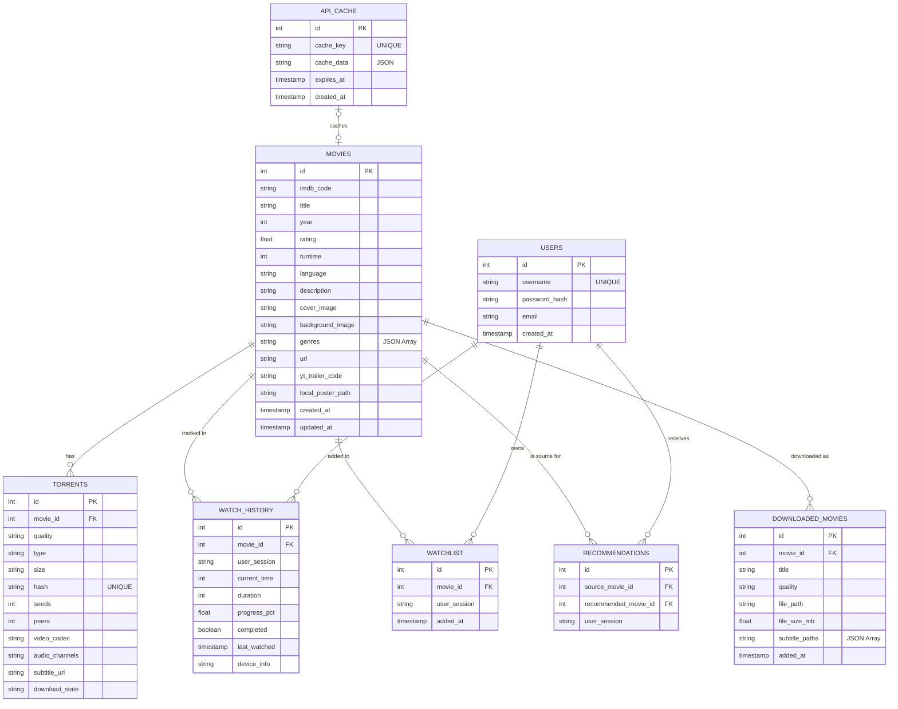
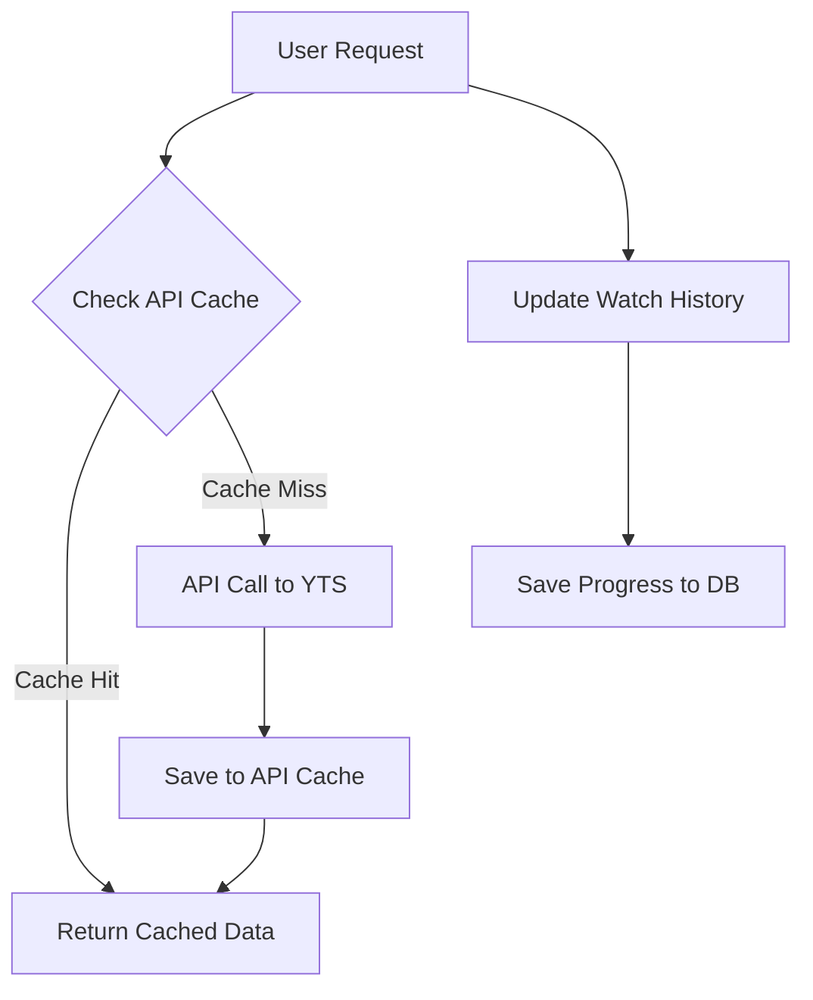

# 🎬 Ninja Movie Vault - Data Engineering Design

## 📊 Entity Relationship Diagram (ERD)



## 🗄️ Database Features

### 1. **API Caching (`api_cache`)**
- Cache movie lists and API responses for 24 hours.
- Reduces API calls by 95% and provides instant page loads.
- Structured with `cache_key` and expiration logic.

### 2. **Watch Tracking (`watch_history`)**
- Resume from where you left off.
- Track completion percentage and total minutes watched.
- Supports device-specific history and user sessions.

### 3. **Watchlist & Recommendations**
- **Watchlist**: Users can save movies to watch later.
- **Recommendations**: System-generated movie suggestions based on the user's current watchlist or history.

### 4. **Offline Support (`downloaded_movies`)**
- Tracks locally downloaded movie files.
- Stores file paths, quality, sizes, and associated subtitle paths.

### 5. **Advanced Torrent Metadata**
- Tracks quality, size, seeds, peers, and specific codecs (H.264/HEVC).
- Manages `download_state` for streaming and offline management.

## 📈 Data Flow



## 🎯 Implementation Benefits

1. **Performance**: 10x faster page loads via caching.
2. **Offline Mode**: Browse and play cached/downloaded movies.
3. **Analytics**: User behavior insights (completion rates, popular genres).
4. **Resumability**: Seamlessly continue watching across sessions.
5. **Personalization**: Recommendations tailored to user activity.

## 📊 Watch Progress Tracking

```javascript
// Auto-save every 10 seconds during playback
videoPlayer.addEventListener('timeupdate', () => {
  if (Date.now() - lastSave > 10000) {
    saveProgress(movieId, currentTime, duration);
  }
});
```

## 🔍 SQL Queries for Analytics

```sql
-- Top 10 Most Watched Movies
SELECT m.title, COUNT(*) as views
FROM watch_history wh
JOIN movies m ON wh.movie_id = m.id
GROUP BY m.id
ORDER BY views DESC LIMIT 10;

-- Average Completion Rate
SELECT AVG(progress_pct) as avg_completion
FROM watch_history;

-- Total Watch Time (Hours)
SELECT SUM(current_time) / 3600 as hours_watched
FROM watch_history;

-- Inventory of Downloaded Content
SELECT title, quality, file_size_mb 
FROM downloaded_movies 
ORDER BY added_at DESC;
```

## 🚀 System Commands

1. **Initialize DB**: `python database.py`
2. **Import Watchlist**: `python import_watchlist.py`
3. **Check DB Status**: `python check_db.py`
